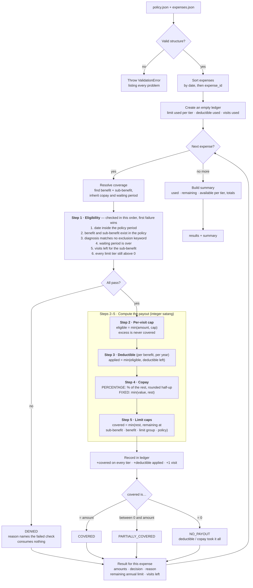

# Engine overview

How `calculate(policy, expenses)` turns a policy and a list of expenses into per-expense results and a summary. Rules and templates are defined in the [design spec](../superpowers/specs/2026-09-11-policy-benefits-calculator-design.md); a worked example with real numbers is in [expense-walkthrough.md](expense-walkthrough.md).

## Reading the diagram

- **The ledger is the only state.** Every non-denied expense writes to it, and every later expense reads from it. That is how earlier claims reduce what later claims can get.
- **Denied expenses never touch the ledger.** This is why "limit exhausted" is checked in step 1 rather than step 5: by step 5 the deductible would already have been taken.
- **Limit tiers are nested.** One claim consumes all the tiers it belongs to, and the smallest remaining balance decides the payout:

  | Tier | Example in `data/policy.json` |
  |---|---|
  | Sub-benefit | Physiotherapy 2,000 / year |
  | Benefit | DENTAL 10,000 / year |
  | Limit group | Dental & Optical combined 12,000 / year |
  | Policy | 100,000 / year |

- **Every result balances:** `submitted = covered + member_pays` and `member_pays = not_covered + deductible + copay`. All arithmetic is in integer satang.
