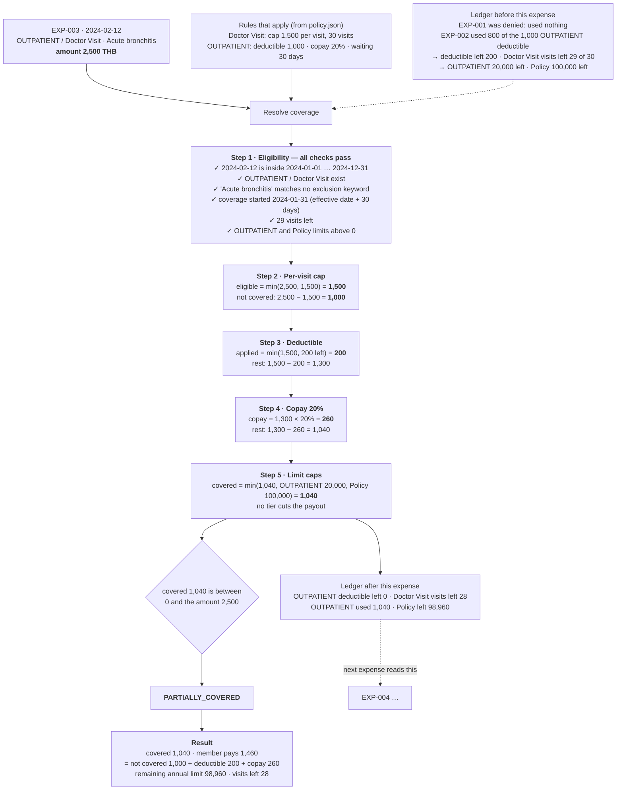

# Expense walkthrough — EXP-003

One expense from [`data/expenses.json`](../../data/expenses.json) traced through the engine with real numbers. EXP-003 is the sample expense from the problem statement, and it exercises the per-visit cap, the deductible and the copay in a single claim. The general flow is in [engine-overview.md](engine-overview.md).

**Input**

```json
{
  "expense_id": "EXP-003",
  "date": "2024-02-12",
  "benefit_type": "OUTPATIENT",
  "sub_benefit": "Doctor Visit",
  "amount": 2500,
  "diagnosis": "Acute bronchitis",
  "provider": "Bangkok Hospital"
}
```



**Output** (exactly as in [`output/results.json`](../../output/results.json))

```json
{
  "expense_id": "EXP-003",
  "submitted_amount": 2500,
  "not_covered_amount": 1000,
  "deductible_applied": 200,
  "copay_amount": 260,
  "covered_amount": 1040,
  "member_pays": 1460,
  "decision": "PARTIALLY_COVERED",
  "reason": "Per-visit cap of 1,500 THB for Doctor Visit applied; 1,000 THB not covered. 200 THB applied to OUTPATIENT deductible (0 THB remaining). 20% copay applied: 260 THB. Covered: 1,040 THB. Member pays: 1,460 THB.",
  "remaining_annual_limit": 98960,
  "remaining_visit_limit": 28
}
```

**Checks**

- `covered + member_pays = 1,040 + 1,460 = 2,500` = submitted ✓
- `not_covered + deductible + copay = 1,000 + 200 + 260 = 1,460` = member pays ✓

**Why it differs from the problem's sample output** (covered 2,000): the sample only shows the output format. Under this policy the Doctor Visit cap of 1,500 applies first, and 200 THB of the deductible was still unpaid, so the 20% copay is taken from 1,300 rather than 2,500.
